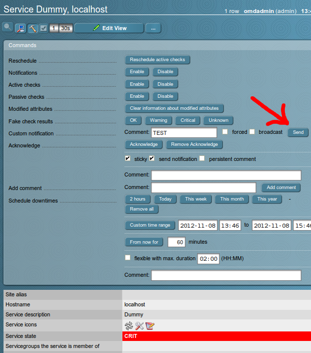
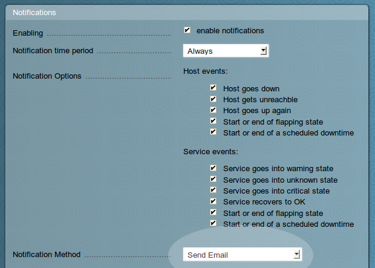
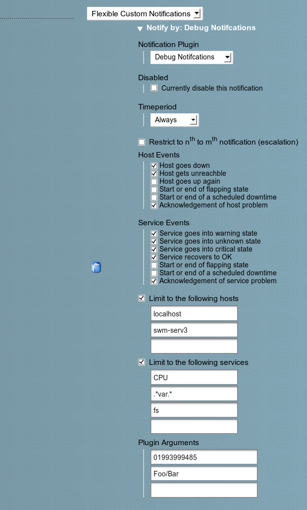

翻译自http://mathias-kettner.com/checkmk_flexible_notifications.html

Last updated: November 08. 2012

## 1. Check_MK的灵活的通知系统

从1.2.1i2 

As of version **1.2.1i2** Check_MK offers a new and very flexible system for sending notifications. This system has a few advantages over the classical Nagios-way of doing it:

- Each user can have *multiple* notification methods with separate filters. That way you can for example send always emails, but SMS only for certain services or in certain timeperiods - **without creating multiple contacts per user**!

- Changes in the notification configuration do not need any restart of the monitoring core.

- Users can change their personal settings themselves via Multisite.

- Adding own notification scripts (for SMS, Ticket systems, etc.) is very simple and does not need anydefine command or similar declaration.

- The configuration can easily be done via WATO - but also with your text editor.

<!-- more -->

## 2. The Basic Principle

The basic idea is that we move the complex things out of the monitoring core (Nagios, Icinga, etc.). If an alert happens then we let the core just decide *whom* to notify - but not *how*. For each notification the core simply calls check_mk --notify while providing all neccessary information about the alert.

check_mk --notify will then read the personal settings of the notified user and decides how to notify. Here additional filters take place so the notification might be dropped at all. Also the user can have multiple ways of notifications at the same time.

The personal notification settings can be editied by the admin or the user himself (if you do not disallow this) via Multisite/WATO.

## 3. Preparing Notifications in General

Setting up the notifications takes some care. If you miss one of the following steps then the most probable case is that simply nothing will happen. You need to do the following:

1. Create a *contact group*. WATO users: this is done with the module *Contact Groups*.

2. Important: put some hosts/services into that contact group. WATO: *Host & Service Parameters / Grouping / Assignment of hosts/services to contact groups*.

3. Create a user and put him into that contact group. Enable notifiations for that user. Enter an email address. WATO: *Users & Contacts*

4. Make sure that your monitoring server is correctly setup so that it can send emails. Test this with

   ​

   ```
   root@linux# echo "Mailbody" | mail -s "Testsubject" harri.hirsch@example.com
   ```

   ​

5. Restart your core with cmk -R or activating changes in WATO.

## 4. Testing and Debugging

When dealing with notifications it's important to know how to test and debug your setup. A very easy way to send test-notifications is to pick a random service that is contained in the upper contact group, open the*Commands* dialog and select *Custom Notification*:



If you have setup your contact and contact group correctly, then you should see a NOTIFICATION entry in your Nagios monitoring logfile:

var/log/nagios.log

```
[1352379217] SERVICE NOTIFICATION: hirni;localhost;Dummy;CUSTOM (CRITICAL);check-
mk-notify;CRIT - This check is always critical;omdadmin;TES

```

As long as you do not get these log entries it does not make any sense to proceed with the configuration of Check_MK's notification engine. For the later one you can turn on debugging in the global settings. Friends of the command line put this into their main.mk:

main.mk

```
# Log information about notifications
notification_logging = 1
# Alternative: more verbose debugging with all variables
# notification_logging = 2
```

WATO users find this setting in *Global Settings / Notifications / Debug notifications*. The resulting log file is in the directory notify below Check_MK's var directory. OMD users find the file in ~/var/log/notify.log. Isn't it great to have fixed paths in OMD, by the way?

Here is an example output for a flexible notification of the user hirni:

~/var/log/notify.log

```
[1352379218] Flexible notification for hirni
[1352379218] Plugin: debug
[1352379218]  - Skipping: notification number 1 does not lie in range 2 ... 999999

```

## 5. Using Plain Email Notification

Before version **1.2.1i2** plain email notification was the only way to go (without own modification to the Nagios configuration). This is still the default. If you have done the upper steps then everything should now work. The subject and body of the email can be customized in the global settings.



Note: The settings done here (enabling, the notification timeperiod and which events to notify) control, which and when Nagios does send notifications to the user. Any change here needs a restart of the core. The settings cannot be changed by the user. If you are using flexible notifications then the easiest way is to choose the following settings:

- Enable notifications
- Timeperiod: *Always*
- All types of events enabled

That way you make sure that notifications make it out of the core and into Check_MK's notification system. Filtering can then be done in a more flexible way using Check_MK, as we will see later.

## 6. Writing notification scripts

The next step in using flexible notifications is writing your own *notification scripts*. Put your own scripts into the directory notifications. It exists in parallel to checks. If this directory does not exist then your are likely to have a too old version of Check_MK. If you are using OMD then better use the directory~/local/share/check_mk/notifications within the site.

Check_MK will consider every *executable* file in this directory as a notification script. You can use any programming language you want. If you use a scripting language (Shell, Perl, Python, etc.) then you can use a comment in the *second line* for giving the script a name. This name will be used in the graphical configuration and be visible to the user. Here is an example for the head of such a script:

~/local/share/check_mk/notifications/mynotify

```
#!/bin/bash
# Notify via Foo Bar

echo "I am called. Yupei."
```

Please make sure that this script is executable (chmod +x). I will speak about the contents of the script later. For a first test the upper example is sufficient.

New in version **1.2.6**: When writing Python scripts you sometimes need an encoding hint in the second line. Write the title in the third line then:

~/local/share/check_mk/notifications/mynotify

```
#!/usr/bin/bash
# encoding: utf-8
# Notify via Foo Bar

echo "I am called. Yupei."

```

## 7. Configuring flexible configurations in WATO

Once you have at least one notification script you can start with the configuration. This is done on a per-user-base by setting the *Notification Method* to *Flexible Custom Notifications*. Each user can have an arbitrary number of configuration entries. Each time a notification is triggered by the core all those entries are being processed. This might result in zero, one or more actual notifications. The following screen shot shows a table with just one entry using the (shipped) notification script *Debug Notifications*. This script just logs the values of all context variables into the notification log (if it's enabled).



You have the following configuration options:

### 7.1. Notification Plugin

The script to call - if you have supplied a title in a comment in the second line of the script then this will be displayed instead of the actual script name.

### 7.2. Disabled

By checking this box the entry will be disabled and no notification done. Just as all other settings in the flexible table no Nagios restart is neccessary. After saving the settings will immediately get active.

### 7.3. Timeperiod

Here you can restrict the notifications to a certain monitoring timeperiod. New timeperiods can be defined with the WATO module *Timeperiods*. Note: you can only select timeperiods that are defined with WATO here. If you do a manual configuration (see later), you can use all kinds of timeperiods.

### 7.4. Restrict to n'th to m'th notification (escalation)

When you have enabled repeated notifications (by setting the notification_interval to a non-zero value) then you can have this entry only deal with certain repetitions of the notification. That way you can have e.g. the first two being sent via email and further notifications via SMS (you need two entries in the table for this).

### 7.5. Host Events / Service Events

This lets you enable/disable notifications for certain types of events. If you have a close look then you will see that here you can also disable notifications for acknowledgements - even if Nagios does not allow to disable them. Please note that an event type must be enabled in the general notification settings of a user as well.

### 7.6. Limit to the following hosts

Here you can set hosts for this notification. The hosts need to be specified as exact match and are case sensitive. Please note that a user cannot get notification for any host he is not a contact for - regardless what you configure here. If you do not use this option do not configure at least one pattern then no filter on the host name will be applied.

### 7.7. Limit to the following services

This provides an easy way to select important services to be notified in some special ways. Just as in the other WATO configuration, specify a list of regular expressions that match the *beginning* of the service descriptions. Please note that a user cannot get notification for any service he is not a contact for - regardless what you configure here. If you do not use this option do not configure at least one pattern then no filter on the service name will be applied.

### 7.8. Plugin Arguments

The texts that are entered here are provided to the notification script in form of environment macros. This allows you to provide additional information, e.g. a mobile phone number. What arguments are required and which meaning the have depends on the notification script.

## 8. Real World Notification Scripts

The last and final step is to write real notifications scripts. You are free to send emails, SMS, place phone calls via Asterisk and do other fancy stuff. Your script or program receives all important data in environment variables, which are prefixed with NOTIFY\_. The shipped debug script shows you which variables are defined. Here is an example log output. The mentioned plugin arguments are provided as a space separated list in NOTIFY_PARAMETERS and also in distinct variables in NOTIFY_PARAMETER_1, NOTIFY_PARAMETER_2, ....

notify.log

```
[1352380032] Flexible notification for hirni
[1352380032] Plugin: debug
[1352380032] Executing /omd/sites/hirn/share/check_mk/notifications/debug
[1352380032] Output: NOTIFY_CONTACTEMAIL=mk@hirni.de
[1352380032] Output: NOTIFY_CONTACTNAME=hirni
[1352380032] Output: NOTIFY_CONTACTPAGER=
[1352380032] Output: NOTIFY_DATE=2012-11-08
[1352380032] Output: NOTIFY_HOSTADDRESS=127.0.0.1
[1352380032] Output: NOTIFY_HOSTALIAS=localhost
[1352380032] Output: NOTIFY_HOSTCHECKCOMMAND=check-mk-ping
[1352380032] Output: NOTIFY_HOSTNAME=localhost
[1352380032] Output: NOTIFY_HOSTNOTIFICATIONNUMBER=0
[1352380032] Output: NOTIFY_HOSTOUTPUT=OK - 127.0.0.1: rta 0.054ms, lost 0%
[1352380032] Output: NOTIFY_HOSTPERFDATA=rta=0.054ms;200.000;500.000;0; pl=0%;40;80;;
[1352380032] Output: NOTIFY_HOSTSTATE=UP
[1352380032] Output: NOTIFY_LASTHOSTSTATE=UP
[1352380032] Output: NOTIFY_LASTSERVICESTATE=WARNING
[1352380032] Output: NOTIFY_LOGDIR=/omd/sites/hirn/var/check_mk/notify
[1352380032] Output: NOTIFY_LONGDATETIME=Thu Nov 8 14:07:12 CET 2012
[1352380032] Output: NOTIFY_LONGHOSTOUTPUT=
[1352380032] Output: NOTIFY_LONGSERVICEOUTPUT=
[1352380032] Output: NOTIFY_NOTIFICATIONTYPE=PROBLEM
[1352380032] Output: NOTIFY_PARAMETERS=0199399485 Foo/Bar
[1352380032] Output: NOTIFY_PARAMETER_1=0199399485
[1352380032] Output: NOTIFY_PARAMETER_2=Foo/Bar
[1352380032] Output: NOTIFY_SERVICECHECKCOMMAND=check_mk-df
[1352380032] Output: NOTIFY_SERVICEDESC=fs_/
[1352380032] Output: NOTIFY_SERVICENOTIFICATIONNUMBER=7
[1352380032] Output: NOTIFY_SERVICEOUTPUT=CRIT - 90.0% used (18.27 of 20.3 GB), (level
[1352380032] Output: NOTIFY_SERVICEPERFDATA=/=18712.1132812MB;16630;18709;0;20788.5820
[1352380032] Output: NOTIFY_SERVICESTATE=CRITICAL
[1352380032] Output: NOTIFY_SHORTDATETIME=2012-11-08 14:07:12
```

Please note that the debug notification script has been removed in version 1.2.7i4. Now you can configure the HTML notification script to output all variables.

## 9. Check_MK Packages (MKP)

Notification scripts can be packaged in [Check_MK Packages](http://mathias-kettner.com/checkmk_packages.html) (MKPs). Simply write them, put them into the correct directory and the packager will find them.

## 10. Non-WATO configuration

All features described in the document can also be used without WATO. If you prefer editing text files or want to generate them by some scripts, please simply create one user with WATO and then have a look intoetc/check_mk/conf.d/wato/contacts.mk. The configuration of the flexible notifications is saved in the keynotification_method. It is a pair of the string 'flexible' and a dictionary with all settings:

`/etc/check_mk/conf.d/wato/contacts.mk`

```
# Written by WATO
# encoding: utf-8

contacts.update(
{'hirni': {'alias': u'Hirnibaldi',
           'contactgroups': ['alle'],
           'email': 'mk@hirni.de',
           'host_notification_commands': 'check-mk-notify',
           'host_notification_options': 'durfs',
           'notification_method': ('flexible',
                                   [{'disabled': False,
                                     'escalation': (2, 999999),
                                     'host_events': ['d', 'u', 'x'],
                                     'only_services': ['CPU',
                                                       '.*var.*',
                                                       'fs'],
                                     'parameters': ['0199399485',
                                                    'Foo/Bar'],
                                     'plugin': 'debug',
                                     'service_events': ['w',
                                                        'u',
                                                        'c',
                                                        'r',
                                                        'x'],
                                     'timeperiod': '24X7'}]),
           'notification_period': '24X7',
           'notifications_enabled': True,
           'pager': '',
           'service_notification_commands': 'check-mk-notify',
           'service_notification_options': 'wucrfs'},
 'omdadmin': {}}
)
```

You can put this directly into main.mk or into any file below conf.d. Note: this will not only create a notification configuration but also create the actual contact definition for Nagios. Please remove any manual contact definition in that case.

##  11.译者后记


