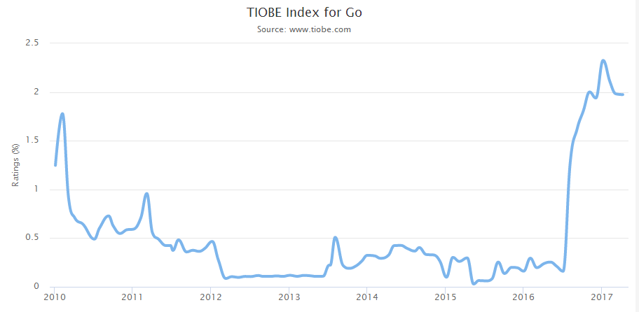

# Go入门指南学习笔记-1


## Golang的起源发展和特点

Go 是有谷歌大神, Rob pike(bell plan9), Robert Griesemer(hotspot), ken tompson(C, UNIX, PLAN9 )

这几个编程语言界的大神就在2008年就开始琢磨, 2009年公开发布的. 2010年年度语言.

目前go的趋势如下:



2016和2017在快速的上升.


Go的设计目标是 将动态语言的易开发性和静态语言的高效安全结合在一起.

因此Go有三个重要特点: 快速编译, 快速执行,快速开发.

另外Go还有另一方面特征,就是并发的特点,有许多特性支持并发编程.


包管理:Go的包管理非常方便,借鉴了动态语言的包管理.

文档:Go的文档内嵌在源码中, 生成文档很方便.

性能:一般的, 我们认为 Go比 动态语言都快,比java 快, 比C 稍微慢一点点.

缺陷: Go的每一个编译文件中 都有一个runtime,所以Go语言的可执行程序比较大.


## Golang的安装与配置

简单说说windows安装, 去官网下载可执行程序

下一步 安装,路径建议不要有空格或者中文.

比如C:\Go

安装完成后,配置一下环境变量


我的电脑 属性, 高级环境变量

```
GOROOT 配置成  C:\Go\
```


`


## Golang的命令与调试


```
go install
go build
go fmt
go doc
go get
go fix
go test
```


